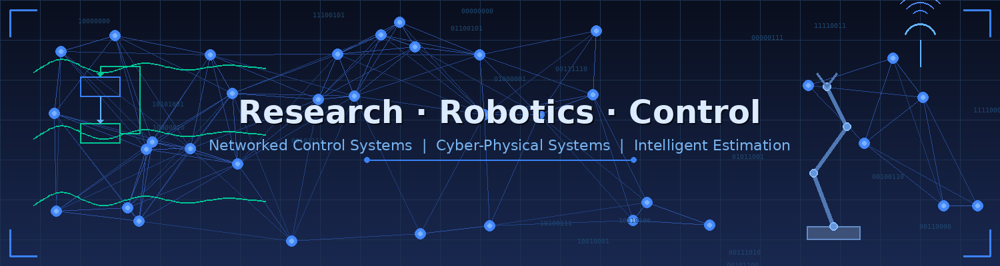

<!-- Profile README -->

<p align="center">
  
</p>

<h1 align="center">
  👋 Hello! I'm <a href="https://www.ayyappadasrajagopal.com/">Dr. Ayyappadas Rajagopal</a>
</h1>

<p align="center">
  <a href="https://www.linkedin.com/in/ayyappadasrajagopal/"></a>
  <a href="https://ayyappadasrajagopal.github.io"></a>
  <a href="https://www.ayyappadasrajagopal.com/"></a>
  <a href="mailto:ayyappadas.r.nair@gmail.com"></a>
</p>

<p align="center">
  
</p>

<p align="center">
  
</p>

---

### 🧑‍🔬 About Me

🎓 **PhD in Electrical Engineering** from **IIT Palakkad**, India  
🧠 Passionate about **Networked Control Systems**, **Estimation & Control**, and **Cyber-Physical Systems**  
🤖 Bridging the gap between **theory and real-world systems** through **hardware-in-the-loop (HIL)** implementations and **applied algorithms**

---

### 🔬 Research Focus

> *"Empowering control systems with resilience and intelligence."*

| Area | Description |
|------|-------------|
| 📡 **State Estimation & Control** | Optimal estimation under **uncertain and unreliable networks** |
| 🔄 **Reinforcement Learning** | **Robust control** strategies for adaptive system performance |
| 🔐 **CPS Security** | Security analysis of **cyber-physical systems** |
| 🧪 **HIL Testbeds** | Real-time validation of theoretical models using hardware-in-the-loop |

---

### 🚀 What I'm Working On

```text
🛠  Building robust estimation frameworks for network-induced delays & packet dropouts
🤖  Developing a startup focused on networked control systems & robotics
📜  Preparing manuscripts for top-tier journals and patent filings
```

---

### 🛠️ Tech Stack & Tools

<p align="center">
  
  
  
  
  
  
  
  
</p>

---

### 💬 Ask Me About

<table>
  <tr>
    <td>📊 Estimation under uncertainty</td>
    <td>🎛️ Control theory & real-time applications</td>
  </tr>
  <tr>
    <td>🔐 Cyber-physical systems</td>
    <td>📝 Research publishing & academia-industry collaboration</td>
  </tr>
</table>

---

### 📊 GitHub Stats

<p align="center">
  
  
</p>

<p align="center">
  
</p>

---

### 📫 Get in Touch

<p align="center">
  <a href="https://ayyappadasrajagopal.github.io">🌐 Portfolio Website</a> •
  <a href="mailto:122004004@smail.iitpkd.ac.in">📧 Official Email</a> •
  <a href="mailto:ayyappadas.r.nair@gmail.com">📧 Personal Email</a> •
  <a href="https://www.linkedin.com/in/ayyappadasrajagopal/">💼 LinkedIn</a> •
  <a href="https://www.ayyappadasrajagopal.com/">🌍 Personal Website</a>
</p>

---

### ⚡ Fun Fact

> I love blending **modern Control Theory** with **advanced Communication Systems** and **sophisticated learning techniques** to build **smarter and safer cyber-physical systems** 🚀

---

<p align="center">
  
</p>

<p align="center">
  ⭐ If you find this interesting, do star and fork! 🍴
</p>

<p align="center">
  <i>Let's connect and build the future of intelligent control systems together!</i>
</p>
